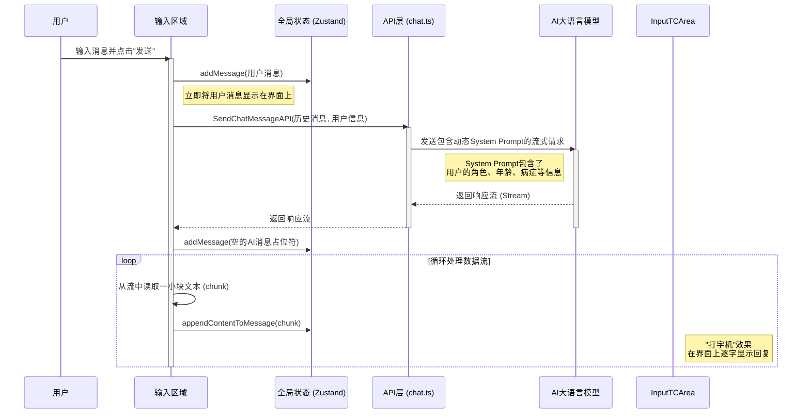

# 核心功能: 02. 咨询模块 (Contact)

本文档详细解析聪言应用的"咨询"模块。该模块是一个基于大语言模型 (LLM) 的智能聊天界面，为用户提供专业的语音康复咨询服务。

## 1. 模块概述

咨询模块的核心是一个实时的、支持流式响应的聊天界面。它位于 `src/pages/contact`，并深度集成了用户状态和 AI 服务。

- **核心组件**:
  - `InputArea.tsx`: 用户输入区，负责发送消息和处理流式响应。
  - `MessageList.tsx`: 消息列表，负责展示对话历史。
  - `MessageItem.tsx`: 单条消息的渲染组件。
- **状态管理**: `src/store/chat.ts` (Zustand)，专为流式聊天设计。
- **API**: `src/api/chat.ts`，封装了与 AI 模型的通信逻辑。

## 2. 数据流与核心逻辑

咨询模块的运作流程清晰地展示了前端如何与现代 AI 服务进行交互：

## 3. 关键实现细节

### 3.1. 动态系统提示 (Dynamic System Prompt)

这是本模块最智能的设计。在 `src/api/chat.ts` 中：

- `createSystemPrompt` 函数会根据 `useAuthStore` 中当前登录用户的 `userInfo`（包括角色、年龄、病症等）动态生成一段上下文描述。
- 这段描述会与一个预设的、包含详细角色定义和行为准则的基础提示词（Prompt）相结合。
- 最终生成的、包含用户上下文的完整 System Prompt，会作为对话历史的第一条消息被发送给 AI 模型。

**这使得 AI 助手的回复能够高度个性化，并始终保持在"语音康复助手"的专业角色内。**

### 3.2. 流式响应与中止处理

- **流式接收**: `InputArea.tsx` 中的 `handleSend` 函数使用 `for await...of` 语法来异步迭代从 `SendChatMessageAPI` 返回的数据流。在每次迭代中，它调用 `ChatStore` 的 `appendContentToMessage` action，将一小段文本追加到UI上，从而实现了"打字机"式的流式显示效果。

- **请求中止**:
  - 在发起 API 请求时，会创建一个 `AbortController` 实例，并将其 `signal` 传递给 API 层。
  - 如果用户在 AI 回复过程中点击"停止"按钮，`InputArea` 会调用 `abortController.abort()`。
  - 这个中止信号会沿着 `InputArea` -> `ChatAPI` -> `OpenAI SDK` 的链路传递下去，中断底层的 HTTP 请求。
  - 被捕获的 `AbortError` 会触发 `ChatStore` 的 `markMessageAsStopped` action，在 UI 上明确告知用户响应已被中止。

### 3.3. 乐观 UI 更新

当用户发送消息时，消息会**立即**通过 `ChatStore` 的 `addMessage` 添加到UI中，而无需等待服务器的确认。这种"乐观UI更新"的策略为用户提供了极佳的即时反馈体验。
